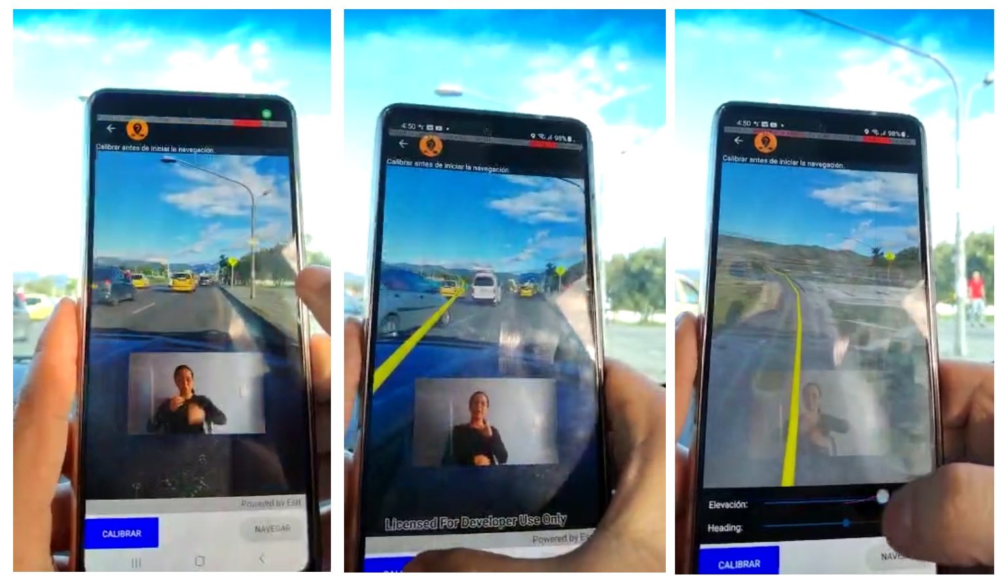

# Tabla de Contenido

### Introducción

Esta solución usa tecnologías de sistemas de información geográfica (SIG) y de realidad aumentada (AR), con el propósito de brindar información de servicios de salud a personas con discapacidad auditiva. El proyecto se desarrolla para dispositivos móviles Android.

## Layers

* [ArcGIS map image layer](Shared/Samples/Layers/ArcGISMapImageLayerUrl/readme.md) - Add an ArcGIS Map Image Layer from a URL to a map.
* [ArcGIS tiled layer](Shared/Samples/Layers/ArcGISTiledLayerUrl/readme.md) - Load an ArcGIS tiled layer from a URL.
* [ArcGIS vector tiled layer URL](Shared/Samples/Layers/ArcGISVectorTiledLayerUrl/readme.md) - Load an ArcGIS Vector Tiled Layer from a URL.

## Location

* [Display device location with autopan modes](Shared/Samples/Location/DisplayDeviceLocation/readme.md) - Display your current position on the map, as well as switch between different types of auto pan Modes.
* [Set up location-driven Geotriggers](Shared/Samples/Location/LocationDrivenGeotriggers/readme.md) - Create a notification every time a given location data source has entered and/or exited a set of features or graphics.
* [Display device location with NMEA data sources](Shared/Samples/Location/LocationWithNMEA/readme.md) - Parse NMEA sentences and use the results to show device location on the map.
* [Show location history](Shared/Samples/Location/ShowLocationHistory/readme.md) - Display your location history on the map.

## Map

* [Access load status](Shared/Samples/Map/AccessLoadStatus/readme.md) - Determine the map's load status which can be: `NotLoaded`, `FailedToLoad`, `Loading`, `Loaded`.
* [Apply scheduled updates to preplanned map area](Shared/Samples/Map/ApplyScheduledUpdates/readme.md) - Apply scheduled updates to a downloaded preplanned map area.
* [Create and save map](Shared/Samples/Map/AuthorMap/readme.md) - Create and save a map as an ArcGIS `PortalItem` (i.e. web map).
* [Browse building floors](Shared/Samples/Map/BrowseBuildingFloors/readme.md) - Display and browse through building floors from a floor-aware web map.
* [Change basemap](Shared/Samples/Map/ChangeBasemap/readme.md) - Change a map's basemap. A basemap is beneath all layers on a `Map` and is used to provide visual reference for the operational layers.
* [Display map](Shared/Samples/Map/DisplayMap/readme.md) - Display a map with an imagery basemap.
* [Display overview map](Shared/Samples/Map/DisplayOverviewMap/readme.md) - Include an overview or inset map as an additional map view to show the wider context of the primary view. 
* [Download preplanned map area](Shared/Samples/Map/DownloadPreplannedMap/readme.md) - Take a map offline using a preplanned map area.
* [Generate offline map](Shared/Samples/Map/GenerateOfflineMap/readme.md) - Take a web map offline.
* [Generate offline map (overrides)](Shared/Samples/Map/GenerateOfflineMapWithOverrides/readme.md) - Take a web map offline with additional options for each layer.
* [Honor mobile map package expiration date](Shared/Samples/Map/HonorMobileMapPackageExpiration/readme.md) - Access the expiration information of an expired mobile map package.
* [Manage bookmarks](Shared/Samples/Map/ManageBookmarks/readme.md) - Access and create bookmarks on a map.
* [Manage operational layers](Shared/Samples/Map/ManageOperationalLayers/readme.md) - Add, remove, and reorder operational layers in a map.
* [Map reference scale](Shared/Samples/Map/MapReferenceScale/readme.md) - Set the map's reference scale and which feature layers should honor the reference scale.
* [Mobile map (search and route)](Shared/Samples/Map/MobileMapSearchAndRoute/readme.md) - Display maps and use locators to enable search and routing offline using a Mobile Map Package.
* [Generate offline map with local basemap](Shared/Samples/Map/OfflineBasemapByReference/readme.md) - Use the `OfflineMapTask` to take a web map offline, but instead of downloading an online basemap, use one which is already on the device.
* [Open map URL](Shared/Samples/Map/OpenMapURL/readme.md) - Display a web map.
* [Open mobile map package](Shared/Samples/Map/OpenMobileMap/readme.md) - Display a map from a mobile map package.
* [Search for webmap](Shared/Samples/Map/SearchPortalMaps/readme.md) - Find webmap portal items by using a search term.
* [Map initial extent](Shared/Samples/Map/SetInitialMapArea/readme.md) - Display the map at an initial viewpoint representing a bounding geometry.
* [Set initial map location](Shared/Samples/Map/SetInitialMapLocation/readme.md) - Display a basemap centered at an initial location and scale.
* [Map spatial reference](Shared/Samples/Map/SetMapSpatialReference/readme.md) - Specify a map's spatial reference.
* [Set min & max scale](Shared/Samples/Map/SetMinMaxScale/readme.md) - Restrict zooming between specific scale ranges.

## SceneView

* [Animate images with image overlay](Shared/Samples/SceneView/AnimateImageOverlay/readme.md) - Animate a series of images with an image overlay.
* [Choose camera controller](Shared/Samples/SceneView/ChooseCameraController/readme.md) - Control the behavior of the camera in a scene.
* [GeoView viewpoint synchronization](Shared/Samples/SceneView/GeoViewSync/readme.md) - Keep the view points of two views (e.g. MapView and SceneView) synchronized with each other.

## Search

* [Find address](Shared/Samples/Search/FindAddress/readme.md) - Find the location for an address.
* [Find place](Shared/Samples/Search/FindPlace/readme.md) - Find places of interest near a location or within a specific area.
* [Offline geocode](Shared/Samples/Search/OfflineGeocode/readme.md) - Geocode addresses to locations and reverse geocode locations to addresses offline.
* [Reverse geocode](Shared/Samples/Search/ReverseGeocode/readme.md) - Use an online service to find the address for a tapped point.

