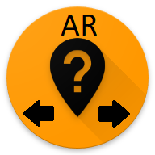
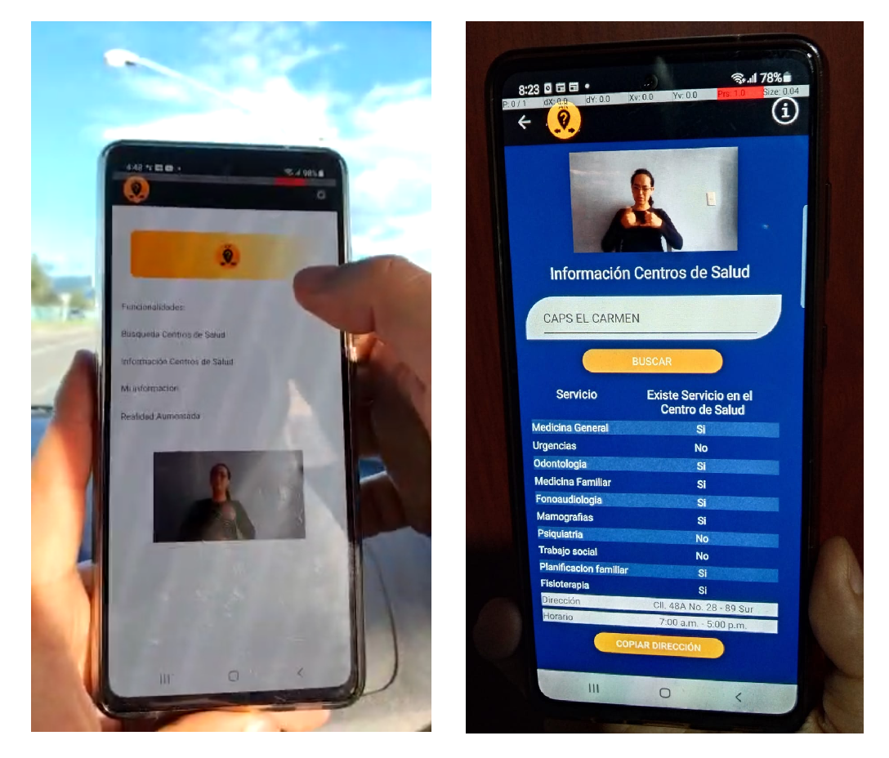
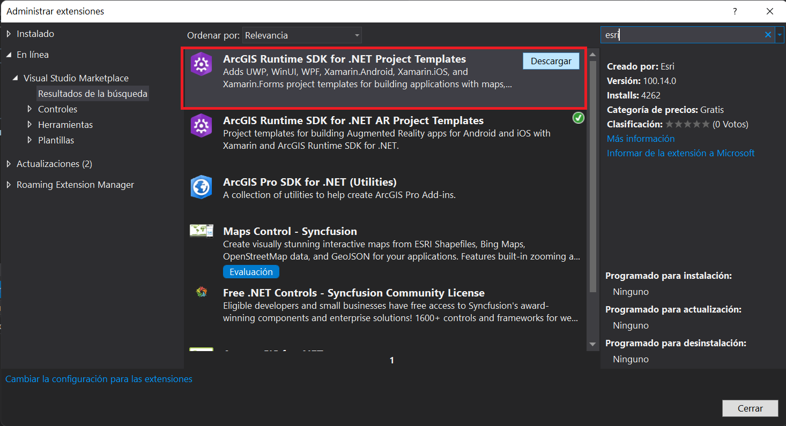
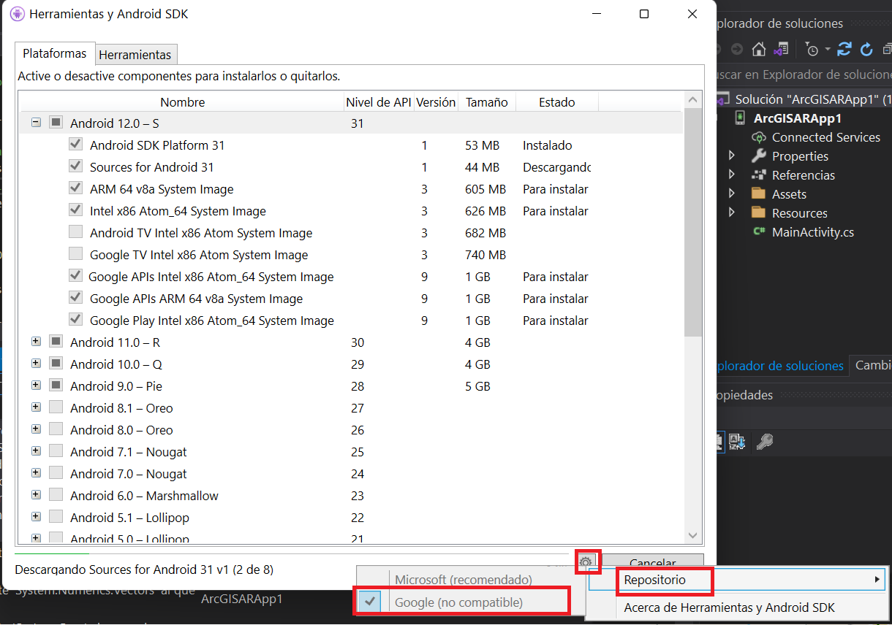
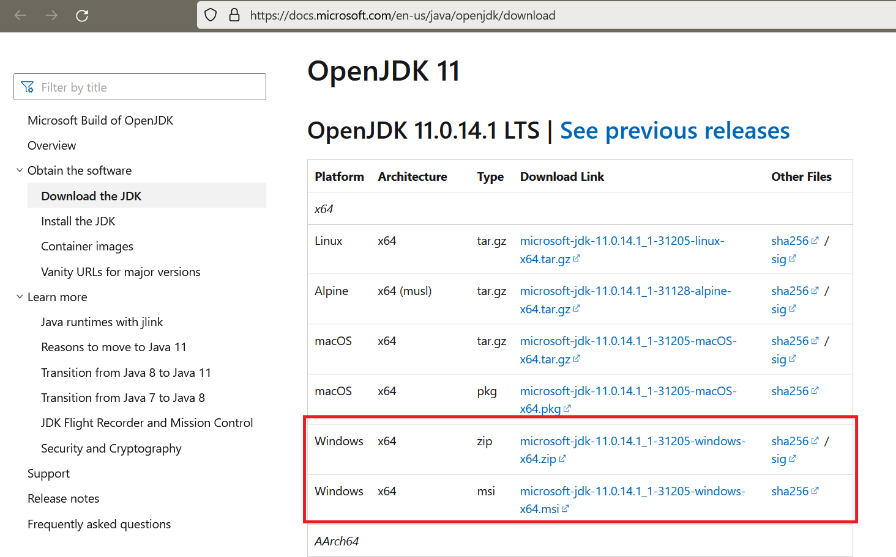

# Contenido

- [Introducción](#introducción)
- [Documentación Complementaria](#documentación-complementaria)
- [Recomendaciones y personalizaciones](#recomendaciones-y-personalizaciones)

## Introducción

Esta solución usa tecnologías de sistemas de información geográfica (SIG) y de realidad aumentada "Outdoor" (AR), con el propósito de brindar información de servicios de salud a personas con discapacidad auditiva. El proyecto se desarrolla para dispositivos móviles Android.

También, usa servicios de ruteo y los muestra en la cámara del celular usando realidad aumentada.

La estructura del proyecto está conformada por las siguientes partes: el framework de Xamarin Forms, el API de ArcGIS Runtime para .NET, el framework de realidad aumentada de ARCore, el uso de bases de datos de SQLite desarrollados e implementados para la plataforma de Android.

## Recomendaciones y personalizaciones

Este proyecto como el ArcGIS Runtime SDK Toolkit se proporciona como un proyecto de código abierto para que pueda personalizarlo. Para este proyecto la computadora de desarrollo esta en SO Windows y está dirigido para dispositivos móviles con SO Android 11 y 12 (API-30 y API-31).

Recuerde que para realizar aplicaciones móviles con realidad aumentada en sistema operativo Android es necesario contar con Servicios de Google Play para RA, el cual ofrece experiencias de RA con AR Core (Google Play, 2022). En (Google Developers, 2022) relacionan un conjunto de [dispositivos compatibles con ARCore](https://developers.google.com/ar/develop/geospatial#unidad-fundaci%C3%B3n-ar), la principal característica se relaciona con el seguimiento de movimiento sensible, que se realiza combinando la imagen de la cámara y la entrada del sensor de movimiento para determinar cómo se mueve el dispositivo del usuario en el mundo real. 

A continuación, se muestran un conjunto de recomendacines o primeros pasos que le ayudaran:

1- Descargue e instale visual studio, puede acceder a una versión de desarrollador en [visual studio comunity](https://visualstudio.microsoft.com/es/vs/community/).

2- Instalar el complemento (Cargas de trabajo - workloads) para Xamarin “Mobile development with .NET”. Si ya tenía instalado Visual Studio con anterioridad vaya a 'Tools > Get Tools and Features...'.

3 - En 'Extenciones > Administrador de extenciones', descague "ArcGIS Runtime SDK para .NET Project Template".

4- En 'Herramientas>Android>Administrador' de Android SDK, verificar las últimas versiones de Android, siga los siguientes pasos para conectarnos al repositorio de Google y descargar las versiones de Android.

5-El reconocimiento y depuración del dispositivo móvil desde Visual Studio se debe configurar. En 'Herramientas>Android>Administrador' se selecciona la pestaña de Herramientas, en la opción de “Extras”, chequear la opción “Google USB Driver”. Finalmente aplicamos cambios.

6- (Opcional) Si se usa Android 12 es necesario [instalar el Java Open JDK 11](https://docs.microsoft.com/en-us/java/openjdk/download) en la maquina de desarrollo, ya que para Visual Studio 2019 o Visual Studio para Mac 8, no será posible apuntar a Android 12.0/API-31 y usar, por ejemplo, Xamarin.Android Designer al mismo tiempo, puede consultar el error en [JDK 11 warning](https://github.com/xamarin/xamarin-android/wiki/JDK-11-Warning). Esto será resuelto en futuras versiones.

Adicionalmente se debe configurar en el equipo de desarrollo en las variables de entorno para que funcione el Java OpenJDK 11, en el Visual Studio vaya a 'Herramientas>Opciones', en las opciones buscamos “Xamarin” y luego “Configuración de Android”, y posteriormente se cambian la configuración de la “Ubicación de Java Developer Kit” a la ruta donde se ejecuta el Java Open JDK 11.

7- Posterior a esto se debe realizar la configuración del dispositivo móvil para que este en [modo desarrollador](https://www.xatakandroid.com/tutoriales/como-activar-opciones-desarrollador-android-sirve). Adicional a esto en el dispositivo móvil se debe activar el "Modo de depuración cuando de conecta el USB".

8- Finalmente cuando se corra la aplicación es necesario desde el dispositivo móvil activar los permisos de cámara y de ubicación.

> **IMPORTANTE** Cuando ejecute el programa, deberá proporcionar una clave de API. Puede obtener una cuenta de desarrollador y una clave gratuitas en el [sitio web de ArcGIS Developers](developers.arcgis.com). Para mas información mirar https://links.esri.com/arcgis-runtime-security-auth.

## Documentación Complementaria

### Layers

* [ArcGIS map image layer](Shared/Samples/Layers/ArcGISMapImageLayerUrl/readme.md) - Add an ArcGIS Map Image Layer from a URL to a map.
* [ArcGIS tiled layer](Shared/Samples/Layers/ArcGISTiledLayerUrl/readme.md) - Load an ArcGIS tiled layer from a URL.
* [ArcGIS vector tiled layer URL](Shared/Samples/Layers/ArcGISVectorTiledLayerUrl/readme.md) - Load an ArcGIS Vector Tiled Layer from a URL.

### Location

* [Display device location with autopan modes](Shared/Samples/Location/DisplayDeviceLocation/readme.md) - Display your current position on the map, as well as switch between different types of auto pan Modes.
* [Set up location-driven Geotriggers](Shared/Samples/Location/LocationDrivenGeotriggers/readme.md) - Create a notification every time a given location data source has entered and/or exited a set of features or graphics.
* [Display device location with NMEA data sources](Shared/Samples/Location/LocationWithNMEA/readme.md) - Parse NMEA sentences and use the results to show device location on the map.
* [Show location history](Shared/Samples/Location/ShowLocationHistory/readme.md) - Display your location history on the map.

### SceneView

* [Animate images with image overlay](Shared/Samples/SceneView/AnimateImageOverlay/readme.md) - Animate a series of images with an image overlay.
* [Choose camera controller](Shared/Samples/SceneView/ChooseCameraController/readme.md) - Control the behavior of the camera in a scene.
* [GeoView viewpoint synchronization](Shared/Samples/SceneView/GeoViewSync/readme.md) - Keep the view points of two views (e.g. MapView and SceneView) synchronized with each other.

### Search

* [Find address](Shared/Samples/Search/FindAddress/readme.md) - Find the location for an address.
* [Find place](Shared/Samples/Search/FindPlace/readme.md) - Find places of interest near a location or within a specific area.

